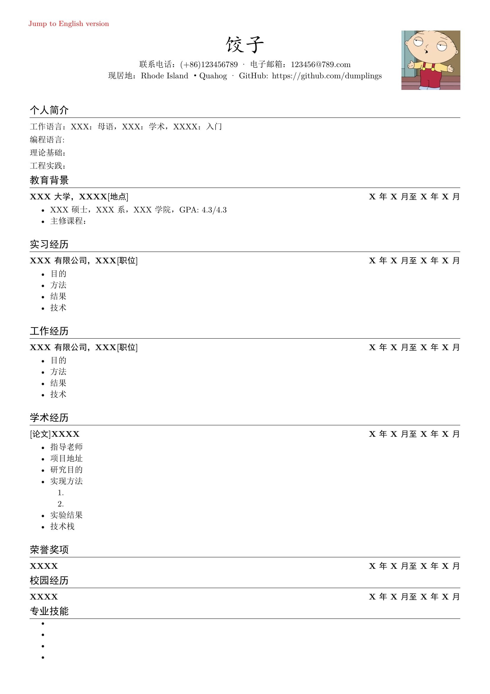
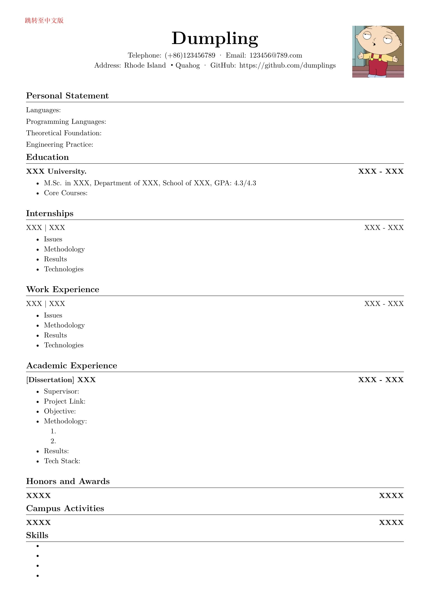

## 关于本项目
中文&英文的双语简历模板

  
  

由于煮波在网上没找到中英双语的latex简历模板 (那种中英文都有的而且可以自由编辑的)，于是自己动手写了一个。这个模板同时提供了中英文简历的跳转功能，当然你也可以调整中文和英文简历的位置或只保留其中之一。
## 如何使用
- 方法1：本地安装textlive并编译
- 方法2：克隆本项目，并将zip文件上传到overleaf，设置overleaf的编译器为XeLaTex

  

简历照片放在./pictures文件夹下，使用你自己的照片替换饺子的头像。修改RESUME.tex文件中的内容，然后编译即可。
## 联系方式
有任何问题欢迎通过邮箱联系我 19257025223@163.com
## 许可
模板代码与样式（例如 `RESUME.tex` 中的排版结构、宏设置）：采用 MIT License。

详情请见根目录的 `LICENSE` 文件。